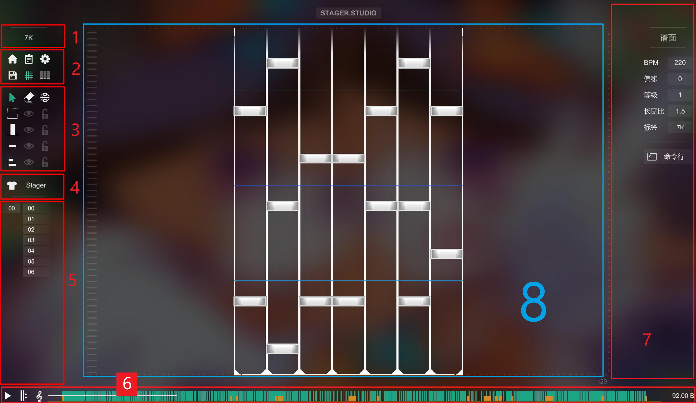
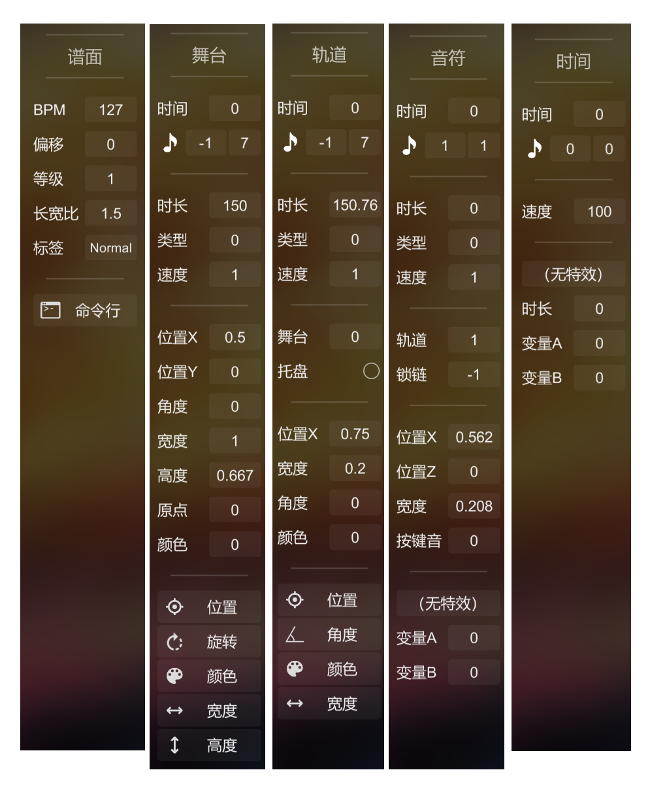
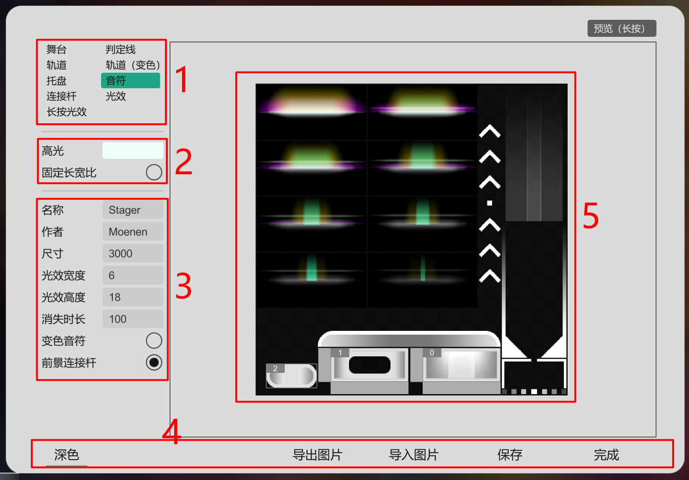
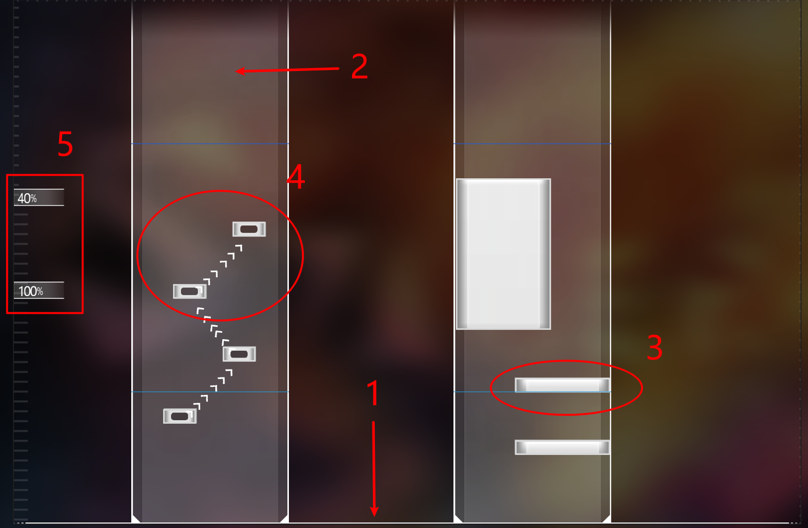
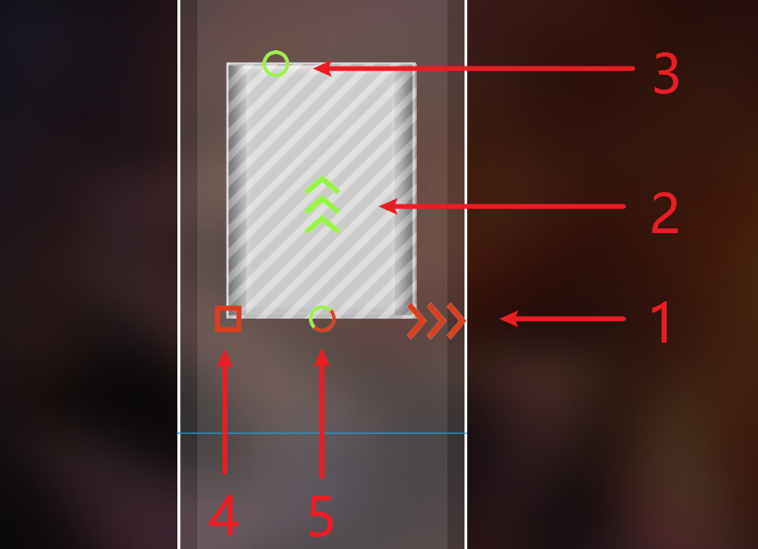
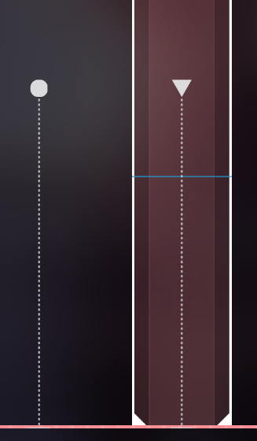

#    Stager Studio 功能介绍
[TOC]
##### 1.概述

Stager Studio 共有两个页面：`主页` 和 `编辑页` ，你可以在主页中选择一个工程并打开它，工程被打开后即会进入编辑页，谱面的创作是在编辑页中完成的。

##### 2.主页

1.  `导航区`，从左到右依次为 主页菜单、新建菜单、回收站。
    - 左键点击主页菜单按钮可弹出菜单，包含导入工程、刷新主页、调整工程排序方式等选项；
    - 左键点击新建菜单按钮可弹出菜单，可用于新建章节、工程；
    - 点击回收站按钮可以打开回收站章节，该章节中保存着被删除的工程，其位置不在 Projects 文件夹内。在回收站中删除工程将彻底删除该工程，使用移动工程功能可以还原回收站中的工程；
2.  `章节区`，该区域显示工作区间内的所有章节，左键点击章节名即可打开相应的章节，右键点击可以弹出菜单（重命名、用资源管理器查看），章节名右侧的数字为章节内工程的数量。主页内并没有删除章节的方法，你只能使用 windows 资源管理器手动删除章节。
3.  `工程区`，该区域显示正在打开的章节内的所有工程，左侧为工程封面，右侧为工程标题、谱面作者和上次编辑的时间。左键点击封面（或双击右侧区域）可以打开该工程，右键点击工程弹出菜单（移动、删除、用资源管理器查看）。

##### 3.编辑页

1.  `谱面切换按钮`，显示当前打开的谱面的标签（tag），左键点击可弹出菜单，可以快速切换到工程内的其它谱面。
2.  `导航栏`，从左到右依次为（第1行）返回主页、工程信息、设置、（第2行）保存工程、网格、全景模式
    - 主页按钮：点击后将会弹出提示窗口，询问用户是否返回主页，选择“是”后将保存当前的修改并返回到主页；选择“否”将不保存当前的修改，直接返回主页；选择“取消”将关闭提示窗口，继续留在编辑页。若当前工程没有未保存的修改，则不显示“否”按钮。
    - 工程按钮：打开工程信息窗口，详情见本文档工程窗口专区。
    - 设置按钮：打开设置窗口，详情见本文档设置窗口专区。
    - 保存按钮：保存当前工程，右键点击该按钮可以弹出菜单，菜单可用于设置自动保存时间。
    - 网格按钮：打开或关闭网格，网格包括主场景网格（用于修改物体位置时对齐物体）、轨道分割线（用于显示节拍时间点）。只有打开网格才能在编辑物体时产生紧贴效果。右键点击该按钮可以弹出菜单，菜单可设置网格的数量、没小节节拍数等。
    - 全景模式按钮：打开或关闭全景模式，该模式无视所有舞台的位置，将舞台从左到右排列在主场境内，同时无视时间点造成的全局变速，主场景右侧会显示音乐波纹。右键点击该按钮可以弹出菜单，菜单可设置全局模式下的舞台宽度。
3.  `工具栏`，第1行从左到右依次为选择模式、删除模式、全局笔刷尺寸。从第2行开始从左到右依次为笔刷、隐藏物体、锁定物体。
    - 选择模式按钮：点击后切换到选择模式，此时点击主场景内的物体即可选中该物体，一次只能同时选中一个物体。选中物体后会显示该物体的控件，用于调整物体的位置、宽度、时长、时间等信息。选中物体后按下delete键即可删除该物体，按WASD键可移动物体的位置。
    - 删除模式按钮：点击后切换到删除模式，此时点击主场景内的物体即可直接删除该物体，删除舞台、轨道时会同时删除所有内部的子物体。
    - 全局笔刷尺寸按钮：点击后开启或关闭全局笔刷尺寸，开启时绘制音符或轨道，绘制物体的尺寸以主场景尺寸为参照物；若关闭全局笔刷尺寸，则改为以该物体的父级作为参照物。例如音符绘制宽度是 0.5 时，若开启全局笔刷尺寸，绘制出的音符的全局宽度总是主场景的 0.5 倍；若关闭全局笔刷尺寸，则宽度时当前音符所在的轨道宽度的 0.5 倍。
    - 舞台笔刷按钮：默认快捷键 `数字键1`，点击后切换至舞台笔刷，此时点击主场景区域即可绘制一个新的舞台，舞台的宽度、高度可通过设置窗口内的笔刷专栏调整。
    - 隐藏舞台按钮：点击后显示或隐藏所有舞台，隐藏功能并不会删除舞台，也不会影响其它物体的运动。隐藏时无法选中、编辑舞台（隐藏轨道、音符、时间点按钮同理）。
    - 锁定舞台按钮：点击后锁定或解锁所有舞台，锁定后无法选中、编辑舞台（锁定轨道、音符、时间点按钮同理）。
    - 轨道笔刷按钮：默认快捷键 `数字键2`，点击后切换至轨道笔刷，此时点击主场景内的舞台即可在其内部绘制一个新的轨道，轨道的宽度可通过设置窗口内的笔刷专栏调整。
    - 音符笔刷按钮：默认快捷键 `数字键3`，点击后切换至音符笔刷，此时点击主场景内的轨道即可在其内部绘制一个新的音符，音符的宽度可通过设置窗口内的笔刷专栏调整。
    - 时间点笔刷按钮：默认快捷键 `数字键4`，点击后切换至时间点笔刷，此时点击主场景区域即可在左侧绘制一个新的时间点。
4.  `皮肤切换按钮`，显示正在使用皮肤的名称，点击皮肤名可弹出菜单并切换至其它皮肤。点击左侧的圆领短袖T恤按钮可以打开皮肤编辑器，编辑当前皮肤（详情见本文档皮肤编辑器专区）。
5.  `选择栏`，显示当前谱面的所有舞台和轨道，左侧列为舞台，右侧列为轨道。点击按钮即可选中相应编号的舞台或轨道，该编号为谱面数据列表中的序号，与物体的时间无关。
6.  `音乐控制栏 `，左侧的按钮从左到右依次为：播放按钮、重复按钮、音调按钮。中键区域为进度条，右侧标签显示当前音乐时间。
    - 播放按钮：点击后播放音乐，再次点击暂停音乐。默认快捷键 `回车键`。
    - 重复按钮：点击后播放音乐，再次点击暂停音乐并返回至上次播放的位置。默认快捷键 `空格键`。
    - 音调按钮：点击按钮上半部分会加快播放速度（音乐音调同时升高），点击按钮下半部分减慢播放速度（音乐音调同时降低）。默认快捷键 `Ctrl + ↑`、`Ctrl + ↓`。
    - 进度条：点击或拖拽时，音乐会跳转到相应位置，音乐会在调整的过程中静音。
    - 时间标签：显示当前音乐的时间进度，默认单位分钟、秒。点击后切换单位至节拍数，节拍数由谱面的 每分钟节拍数（BPM）和偏移（Shift）决定。
7.  `属性栏`，显示当前选中物体的属性面板，属性面板共有5种：谱面属性、舞台属性、轨道属性、音符属性、时间点属性。当没有选中物体时，属性栏显示谱面属性面板，否则显示相应的属性面板，详情见本文档属性面板专区。
8.  `主场景`，主场景用于显示当前的谱面内容，主要的创作工作都发生在主场景中，详情见本文档主场景专区。

##### 4.工程窗口

- 工程窗口用来编辑工程文件的内容，窗口中的信息都保存于工程文件中。
- `信息专栏`，点击浏览按钮选择文件，清除按钮删除当前的内容。
- `谱面专栏`，右键点击谱面弹出菜单，提供打开、复制、导出、删除谱面的选项。

- `调色板专栏`，显示工程调色板的所有颜色，点击颜色即可编辑颜色，右键点击可以弹出菜单并选择是否删除颜色。颜色拥有透明度通道，可用于舞台、轨道的颜色与变色。

- `补间专栏`，显示工程中所有的补间曲线，点击曲线即可开始编辑曲线，右键点击可以弹出菜单并选择是否删除补间。补间用于填补舞台、轨道运动关键帧之间的间隙。补间曲线的横坐标代表运动的时间，0表示运动间隙左侧的关键帧对应的时间（1表示右侧）；纵坐标代表运动的进度，0表示间隙左侧的关键帧对应的进度（1表示右侧）。例：图中的补间0表示匀速运动，3表示整个间隙一直保持左侧关键帧的进度。

    

- `按键音专栏`，显示工程中所有的按键音，点击按键音可以播放一次按键音，右键点击可以弹出菜单并选择是否删除按键音。每个按键音都是独立的音频文件，数据保存在工程文件内部。每个音符都会在触发时播放其对应编号的按键音。

##### 5.设置窗口

- 设置窗口用于编辑软件设置，窗口内的信息保存在软件内部和注册表中
- `通用专栏`，常用设置，帧频率为目标帧频率，实际帧频率会尽可能达到该数值；音乐特效是音符与时间点的特效开关；当声波开启时，只在全景模式下显示；谱面预览是指进度条上显示的谱面缩略图；
- `编辑器专栏`，谱面编辑相关的设置，内容如图。

- `笔刷专栏`，调整绘制舞台、轨道、音符的尺寸大小。
- `语言专栏`，显示语言文件夹中的所有语言，点击按钮立刻切换语言，语言包为可阅读的文本文件。若想使用自制语言文件，可将文件放入语言文件夹后，点击右上方的刷新按钮。

- `皮肤专栏`，显示皮肤文件夹中的所有皮肤，点击即可立刻切换皮肤。该皮肤为舞台、轨道、音符等物体的皮肤，编辑器皮肤不可修改。点击铅笔按钮编辑皮肤。
- `快捷键专栏`，显示所有支持的快捷键，点击按键名称后进入编辑状态，此时按下按键即可设置按键。点击“×”按钮重置按键。

##### 6.属性面板

- `谱面属性`，未选择物体时显示谱面属性面板。
    - BPM：每分钟节拍数，只影响网格和绘制编辑时的紧贴对齐。
    - 偏移：单位ms（千分之一秒），只影响网格和绘制编辑时的紧贴对齐，不影响音符时间。
    - 等级：谱面的难度等级，此版本发布时还没有确定难度的规范。
    - 长宽比：谱面主场景的长宽比例。
    - 标签：谱面的标签，可填写难度、键数等信息。
    - 命令行：打开命令行窗口，可用于批量修改物体信息。
- `舞台属性`，选择舞台时显示的属性面板。
    - 时间：舞台出现的时间，此时间为相对于音乐的时间，单位秒。
    - 节拍时间：左边的输入框为舞台时间的节拍数，右侧输入框为舞台时间的节拍细分数，音符图标可改变节拍细分量。例如：当音符为八分音符时，每个节拍都被细分为8拍，“节拍9细分4” 表示第9.5个节拍的时间、“节拍24细分7” 表示第24又8分之7个节拍的时间。
    - 时长：舞台的持续时长，单位秒。
    - 类型：舞台的外观类型，决定了舞台要被显示成皮肤文件中的第几个样式。
    - 速度：舞台内音符的下落速度倍数，与所有影响音符下落速度的倍数相乘后共同产生影响。
    - 位置X：舞台的横向位置，0表示主场景最左侧，1表示主场景最右侧。
    - 位置Y：舞台的纵向位置，0表示主场景底部，1表示主场景顶部。
    - 角度：舞台的旋转角度，0表示上方朝上，90表示上方朝右，180表示上方朝下。
    - 宽度：舞台的宽度，0表示宽度无限小，1表示与主场景宽度相同。
    - 高度：0表示高度无限小，1表示与主场景**宽度**相同。
    - 原点：舞台运动基准点的纵向位置（横向位置永远为正中间），0表示舞台底部，0.5表示舞台正中间，1表示舞台顶部。
    - 颜色：舞台颜色在调色板上的编号。
    - 位置、旋转、颜色、宽度、高度：编辑舞台的相应运动，详情见本文档运动编辑专区。
- `轨道属性`，选择轨道时显示的属性面板（部分属性不再赘述）
    - 舞台：轨道父级舞台的编号。
    - 托盘：轨道是否有接水果式托盘。
    - 位置X：轨道的横向位置，0表示舞台最左侧，1表示舞台最右侧。原点位于轨道横向正中间、纵向底部。
    - 宽度：轨道的宽度，0表示宽度无限小，1表示与舞台宽度相同。
    - 角度：轨道的倾斜角度，0表示不倾斜（与舞台重合），90表示像后倾斜（与舞台垂直）。
- `音符属性`，选择音符时显示的属性面板（部分属性不再赘述）
    - 锁链：链接音符编号，值为 -1 时不链接其它音符，值大于等于 0 时，编号对应的音符将成为被链接的下一个音符。
    - 位置X：音符的横向位置，0表示轨道最左侧，1表示轨道最右侧。原点位于音符横向正中间、纵向底部。
    - 位置Z：音符的高度位置，0表示紧贴轨道，大于0时悬浮于轨道上空，1表示悬浮高度与主场景宽度相同；
    - 宽度：音符的宽度，0表示宽度无限小，1000表示与轨道宽度相同。
    - 按键音：按键音编号。
    - 特效：点击按钮弹出菜单并选择该音符所使用的特效。
    - 变量A、B：特效的参数。
- `时间点属性`，选择时间点时显示的属性面板（部分属性不再赘述）
    - 速度：时间点的下落速度，影响该时间点到下一个时间点之间的音符下落速度。整数，单位**百分之一**倍。
    - 时长：时间点的特效时长。

##### 7.运动编辑

- `运动时间轴`，编辑运动时显示在主场景右侧，点击完成按钮结束运动编辑；点击音符按钮切换时间轴的细分程度；下方的两个输入框为当前选中关键帧的数值和补间编号，双击补间编号输入框可以快速选择补间。时间轴每行显示一个节拍上的关键帧，第一行表示物体开始时的时间。左键点击空白处可添加关键帧，左键点击关键帧可选中关键帧，按Delete键删除选中的关键帧。粉色竖线表示当前的音乐时间，右键拖拽时间轴可以修改音乐时间。

- `舞台位置运动`，编辑该运动时，主场景显示音乐时间相邻两个关键帧的控件，拖拽控件可以调整关键帧位置。

- `舞台角度运动`，编辑该运动时，主场景显示音乐时间附近关键帧的控件，拖拽控件上的红色圆环可以调整相应关键帧的角度数值。

- `舞台颜色运动`，编辑该运动时，主场景显示音乐时间附近关键帧的控件，拖拽控件上的红色圆环可以调整相应关键帧的颜色，最左侧表示调色板第一个颜色，最右侧表示最后一个颜色。

- `舞台宽度运动`，`舞台高度运动`，主场景显示音乐时间附近关键帧的控件，拖拽控件上的红色方块可以调整相应关键帧的宽度或高度，最左侧表示0，中间表示1，最右侧表示16。

- `轨道位置运动`，主场景显示音乐时间附近关键帧的控件，拖拽控件上的红色圆环可以调整相应关键帧的位置，最左侧表示0，最右侧表示1，控件的横向位置位于父级舞台的正中间。

- `轨道倾斜运动`，主场景显示音乐时间附近关键帧的控件，拖拽控件上的红色圆环可以调整相应关键帧的倾斜角度。

##### 8.皮肤编辑器

1. `物体类型`，选择当前编辑的物体类型，右侧区域只显示当前编辑的物体图块。
    - 舞台：舞台的本体，铺满整个舞台区域，图块编号表示物体的种类；
    - 判定线：位于舞台底部，横向铺满整个舞台，图块编号表示物体的种类；
    - 轨道：轨道本体，铺满整个轨道区域，不参与颜色叠加，图块编号表示物体的种类；
    - 轨道（变色）：铺满整个轨道区域，参与颜色叠加，图块编号表示物体的种类；
    - 托盘：位于轨道底部，只在轨道拥有托盘时显示；
    - 音符：音符物体，图块编号表示物体的种类；
    - 连接杆：锁链音符之间的连接杆，图块编号表示音符的种类；
    - 光效：音符触发时显示的特效，只在音乐播放时显示，图块编号表示帧数；
    - 长按光效：长按音符按住时显示的特效，只在音乐播放时显示，图块编号表示帧数；
2. `图块属性`，正在选中的图块的属性。
    - 高光：长按音符、锁链连接杆在触发时叠加的颜色；
    - 固定长宽比：该图块是否锁定长宽比例，若锁定，则该物体不受谱面信息宽度的影响；
3. `皮肤属性`，属于皮肤文件的属性。
    - 名称：皮肤的文件名，只建议使用英文、数字、下划线；
    - 作者：皮肤的作者名；
    - 尺寸：皮肤的尺寸倍数，数字越大物体在场景中越小；
    - 光效宽度，光效高度：光效在主场景中的额外附加尺寸；
    - 消失时长：舞台、轨道在临近出现和消失时缓慢变透明的时长，单位毫秒；
    - 变色音符：轨道的颜色是否叠加到音符上；
    - 前景连接杆：连接杆能否挡住音符；
4. `通用按钮`
    - 深色：是否使用深色背景，不影响皮肤的实际颜色；
    - 导入图片、导出图片：导入或导出皮肤文件的背景图片；
    - 保存：保存当前的修改；
    - 完成：保存修改并关闭皮肤编辑器窗口；
5. `图块区`
    - 在空白区域拖拽可以创建新图块，拖拽图块边缘调整大小，拖拽图块内部调整位置；
    - 点击图块可选中图块，选中后右下方会显示属性面板；
    - 为图块设置边框可使其适用九宫格拉伸逻辑；
    - 启用3D可以让图块显示为立体物体，物体的侧边样式由图块左侧和底部决定；

##### 9.主场景

- 主场景用于显示当前的谱面内容，主要的创作工作都发生在主场景中。左键点击物体可以选中物体，点击空白区域取消选择。鼠标滚轮或右键拖拽可调整音乐时间进度，按住Ctrl并滚动鼠标滚轮可调整下落速度，按住Ctrl并按下滚轮键可将下落速度设置为1倍。选中物体时按下Delete键即可删除该物体，删除物体时会同时删除内部的子物体。

1. `舞台`（图中标记为判定线部分），舞台是Stager框架中的根物体，数量不限，位置可以在主场景的任意位置。舞台底部是判定线，舞台是唯一拥有判定线的物体，也是唯一能够承载轨道的物体。
2. `轨道`，轨道直接位于某个舞台中，该舞台为轨道的父舞台。父舞台运动时轨道也会随之运动，轨道纵向位置位于父舞台的底部，轨道的纵向尺寸等于父舞台的纵向尺寸。轨道是唯一能够承载音符的物体。
3. `音符`，音符直接位于某个轨道中，该轨道为音符的父轨道。父轨道运动时音符也会随之运动。所有音符都可被设置为长按音符，当时长为0时，该音符为点击音符。
4. `锁链音符`，当音符的“锁链”值不为-1时，该音符会和指定编号的音符链接，不同舞台、轨道的音符也可以链接。
5. `时间点`，时间点用于实现谱面的动态变速，时间点位于主场景左侧边缘，时间点不受变速影响。时间点会影响其本身到下个时间点之间的下落速度，速度可为负值。

- `维度控件`，选中物体时会显示该物体的控件，拖拽控件上的按钮可以修改相应的数值。这里修改的是物体的基础数值，不会改变（第7板块中提到的）运动信息。

1. 横向位置：调节物体的横向位置；
2. 纵向位置：调节物体的时间，从而影响纵向位置；
3. 持续时长：调节物体的持续时长；
4. 宽度：调节物体的宽度；
5. 横向纵向位置：同时调节横向和纵向的位置；

 

- `时间控件`，当舞台、轨道即将出现或将要消失时，会显示图中的时间控件（圆形表示出现、三角形表示消失，空心表示舞台、实心表示轨道）。拖拽该控件可以快速修改物体的出现时间或持续时长。

本文结束

